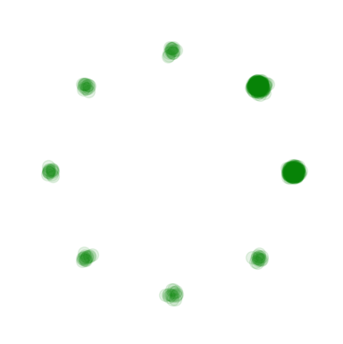
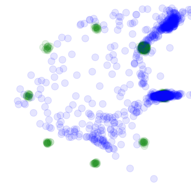
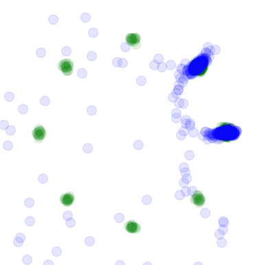
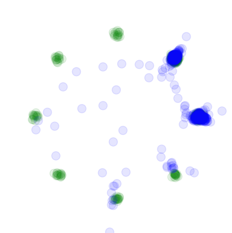
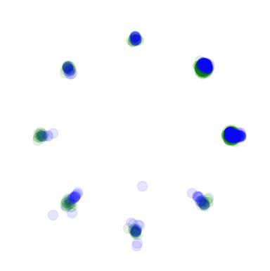
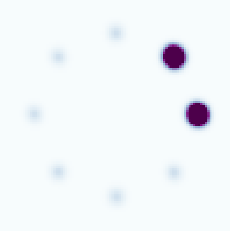
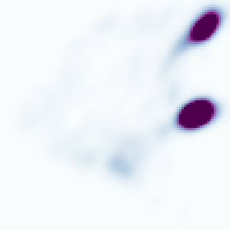
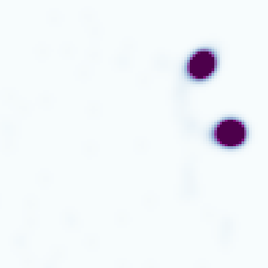
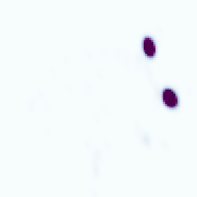

# Collaborative Sampling in Generative Adversarial Networks

This repository provides a *basic* PyTorch implementation of the Collaborative Sampling in Generative Adversarial Networks.

#### [Paper](https://aaai.org/ojs/index.php/AAAI/article/view/5933/5789)  |  [Poster](https://drive.google.com/open?id=1dAO_rptJ7qOhPHVMW_9hS425Wm83LcL8)  |  [TensorFlow](https://github.com/vita-epfl/collaborative-gan-sampling)

## Requirements

To install requirements:

```setup
pip install -r requirements.txt
```

## Training

To train the GANs, run this command:

```bash
python main.py --mode="train" --niter
```

## Sampling

To collaboratively sample from the trained GANs, run this command:

```bash
python main.py --mode="collab" --ckpt_num=3000 --niter=3000 --lrd=5e-2
```

## Result

| | Real | Vanilla Sampling <br> GAN 1K Iter | Vanilla Sampling <br> GAN 3K Iter | Vanilla Sampling <br> GAN 10K Iter | Collab Sampling <br> GAN 3K Iter |
|:-------------------------:|:-------------------------:|:-------------------------:|:-------------------------:|:-------------------------:|:-------------------------:|
Samples | |  |  |  |  
KDE | |  |  |  |  |

## Citation

If you use this code for your research, please cite our paper.

```
@article{liu2019collaborative,
  title={Collaborative Sampling in Generative Adversarial Networks},
  author={Liu, Yuejiang and Kothari, Parth and Alahi, Alexandre},
  booktitle={Thirty-first AAAI conference on artificial intelligence},
  year={2020}
}
```